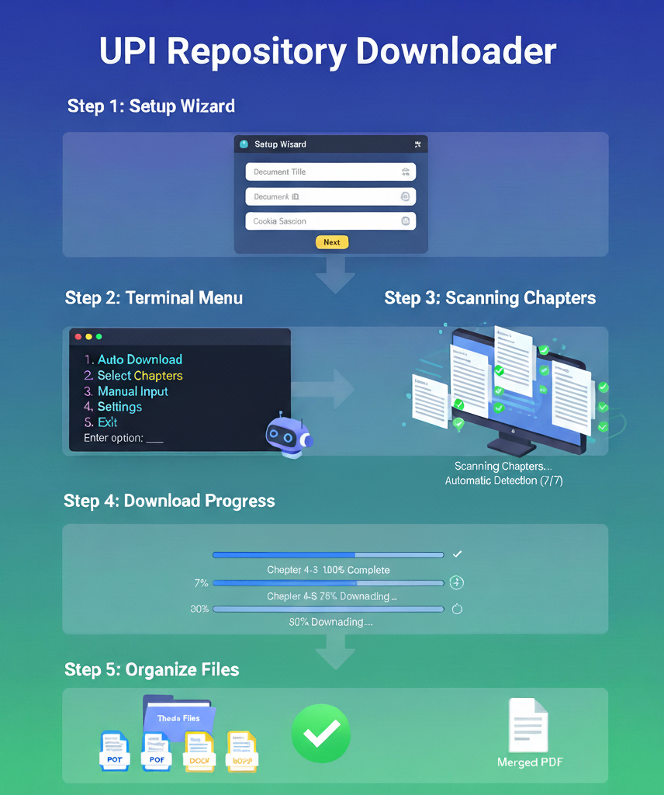
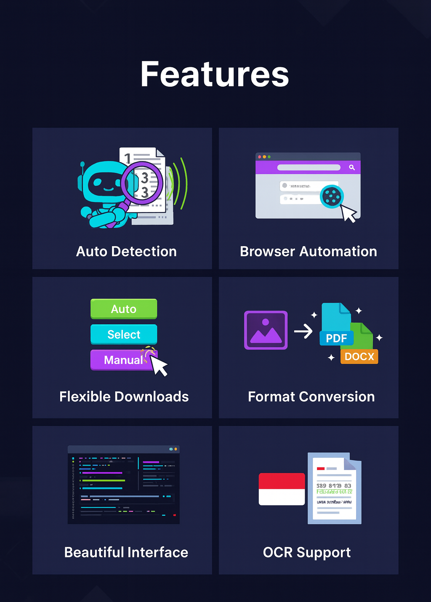
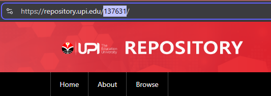
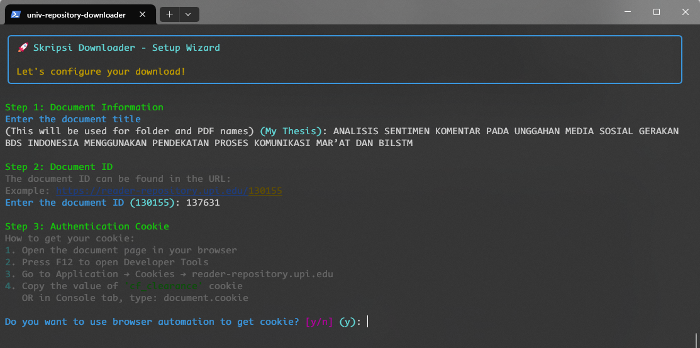
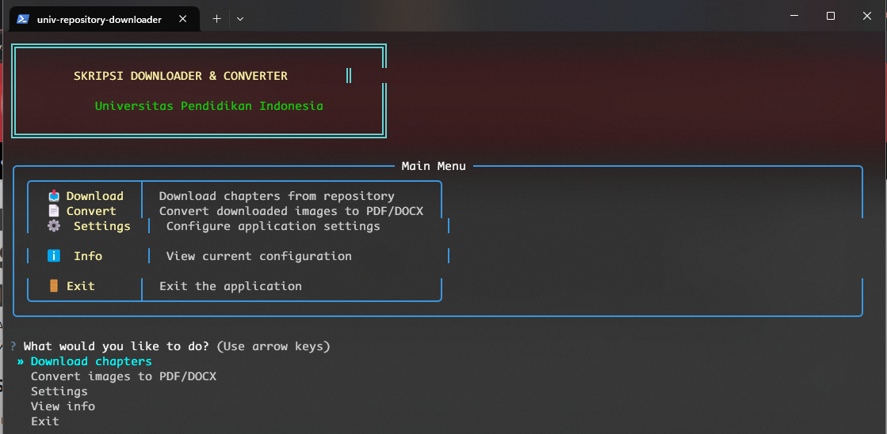
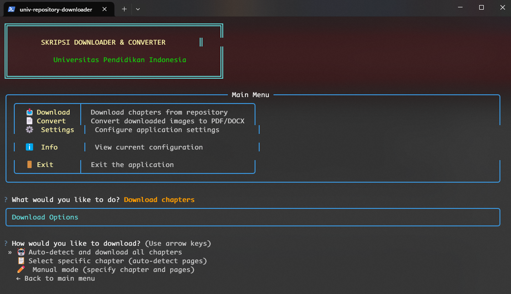
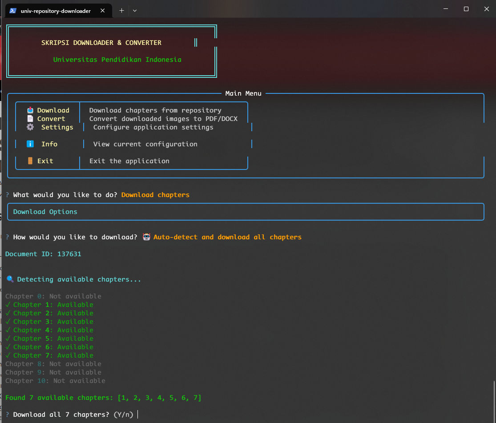
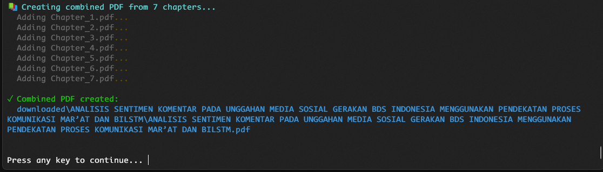

# 📚 UPI Repository Downloader



A beautiful, modular Python application for downloading and converting thesis chapters from Universitas Pendidikan Indonesia (UPI) repository.

## ✨ Features



- 🤖 **Auto-detect chapters and pages** - No manual counting needed
- 🌐 **Browser automation** - Automatic cookie extraction
- 📥 **Flexible downloads** - Download all, specific, or manual ranges
- 📄 **Multiple formats** - PDF (fast) or DOCX with OCR (text extraction)
- 🎨 **Beautiful UI** - Interactive terminal interface with progress bars

## 🚀 Quick Start

### Option 1: Use the Executable (Easiest - Windows Only)

**No Python installation required!**

#### 📥 Download & Install

1. **Go to [Releases](https://github.com/KrisnaSantosa15/univ-repository-downloader/releases/latest)**
2. **Download** `UPI-Repository-Downloader-v3.0.0.zip` (~40 MB)
3. **Extract** the ZIP file to any location (e.g., `C:\Tools\UPI-Downloader`)
4. **Double-click** `UPI-Repository-Downloader.exe`
5. **Follow** the setup wizard

**Windows Security Warning:** When you first run the EXE, Windows may show *"Windows protected your PC"*. This is normal for unsigned applications. Click **"More info"** → **"Run anyway"**.

#### 📋 What's Included

The executable package includes:
- ✅ Python runtime (no installation needed)
- ✅ All required libraries
- ✅ Complete documentation

**Optional (for advanced features):**
- Chrome browser - For automatic cookie extraction
- Tesseract OCR - For DOCX conversion with text extraction

[📦 Download Latest Release](https://github.com/KrisnaSantosa15/univ-repository-downloader/releases/latest) | [📖 Full Release Guide](dev/guides/GITHUB_RELEASE_GUIDE.md)

---

### Option 2: Run from Source (For Developers / All Platforms)

#### Prerequisites
- Python 3.8 or higher
- pip (Python package manager)
- Git (optional, for cloning)

#### Installation Steps

1. **Clone or Download the Repository**
```bash
git clone https://github.com/KrisnaSantosa15/univ-repository-downloader.git
cd univ-repository-downloader
```
Or download as ZIP from GitHub and extract.

2. **Install Python Dependencies**
```bash
pip install -r requirements.txt
```

3. **(Optional) Install Tesseract OCR**
For DOCX conversion with text extraction:
- **Windows**: [Download installer](https://github.com/UB-Mannheim/tesseract/wiki) and add to PATH
- **Linux**: `sudo apt install tesseract-ocr tesseract-ocr-ind`
- **macOS**: `brew install tesseract tesseract-lang`

4. **Run the Application**
```bash
python main.py
```

## 📖 Usage

### First Run - Setup Wizard
The app will guide you through:
1. **Document Title** - Enter the thesis name
2. **Document ID** - Find it in the URL: `https://reader-repository.upi.edu/[ID]`



3. **Authentication** - Choose browser automation (easy) or manual cookie entry

Your settings are saved to `download_config.txt` for next time.



### Main Menu Options

#### 📥 Download
- **Auto-detect all**: Finds and downloads all chapters automatically
- **Select specific**: Pick one chapter with auto page detection
- **Manual mode**: Specify exact chapter and page numbers








#### 📄 Convert
Convert downloaded images to:
- PDF (preserves image quality)
- DOCX with OCR (extracts text - Indonesian/English)

#### ⚙️ Settings
Update document ID, cookies, output folder, or OCR language

#### ℹ️ Info
View current configuration and downloaded chapters

## 📁 Output Structure

```
downloaded/
└── [Your Document Title]/
    ├── chapter_1/
    │   └── page_000.jpg, page_001.jpg...
    ├── chapter_2/...
    ├── Chapter_1.pdf
    ├── Chapter_2.pdf
    └── [Document Title].pdf  ← Combined PDF
```

## 🔧 Getting Cookies (if not using browser automation)

1. Log in to https://reader-repository.upi.edu/
2. Press `F12` → Go to **Application** tab
3. Navigate to **Cookies** → `reader-repository.upi.edu`
4. Copy values of `cf_clearance` and `PHPSESSID`
5. Paste into the setup wizard

## 🛠️ Utility Scripts

- **Check dependencies**: `python scripts/check_dependencies.py`

## 📁 Project Structure

The project follows a professional modular structure:

```
univ-repository-downloader/
├── main.py              # Entry point
├── src/                 # Source code
│   ├── config/         # Configuration
│   ├── core/           # Core logic (download, convert)
│   └── ui/             # User interface
├── scripts/            # Utility scripts
├── documentation/      # Screenshots & docs
└── downloaded/         # Output directory
```

See [PROJECT_STRUCTURE.md](PROJECT_STRUCTURE.md) for detailed documentation.

## 🐛 Common Issues

| Problem | Solution |
|---------|----------|
| No chapters found | Update cookies (they expire!) |
| Browser automation fails | Install Chrome or use manual cookie entry |
| OCR not working | Install Tesseract and add to PATH |
| Download fails | Get fresh cookies using browser automation |

## 🤝 Contributing

Want to improve this tool? Here's how:

1. **Fork** the repository
2. **Create** a feature branch: `git checkout -b feature-name`
3. **Commit** your changes: `git commit -m 'Add feature'`
4. **Push** to branch: `git push origin feature-name`
5. **Submit** a pull request

### Code Guidelines
- Follow PEP 8 style
- Add comments for complex logic
- Test before submitting
- Keep user experience smooth

### Adapting for Other Repositories
Modify these files:
- `src/config/config.py` - Update URL patterns
- `src/core/downloader.py` - Adjust chapter detection
- `src/core/browser_automation.py` - Update cookie requirements

## ⚠️ Legal & Ethics

**For personal educational use only.**

✅ Do:
- Use for your own research/study
- Respect rate limits (built-in delays)
- Have legitimate access to documents

❌ Don't:
- Share or distribute downloaded content
- Overwhelm servers with requests
- Violate copyright laws
- Share your `download_config.txt` (contains session cookies)

## 📜 License

Educational use only. Use responsibly and ethically.

## 🙏 Acknowledgments

Built with these amazing tools:
- [Rich](https://github.com/Textualize/rich) - Beautiful terminal UI
- [Questionary](https://github.com/tmbo/questionary) - Interactive prompts
- [Selenium](https://www.selenium.dev/) - Browser automation
- [Tesseract OCR](https://github.com/tesseract-ocr/tesseract) - Text extraction
- [img2pdf](https://gitlab.mister-muffin.de/josch/img2pdf) - Fast PDF creation

Special thanks to **UPI (Universitas Pendidikan Indonesia)** for their repository system.

---
